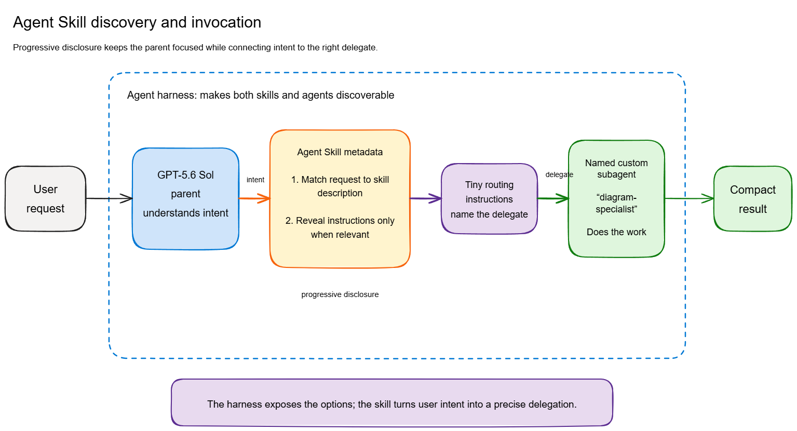
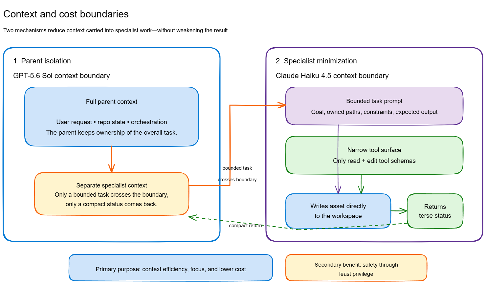

# Agent Skill Pattern

**Agent Skill Pattern** is repository-local terminology for a specific composition of
already-established agent mechanisms: a small, progressively disclosed Agent **Skill**
that helps a parent model discover a bounded need, which in turn instructs or causes
the runtime to delegate to a separate, cost-tiered, tool-minimized **custom subagent**.
The subagent writes its output artifact directly to the workspace and returns a compact
status to the parent, instead of streaming the work through the parent's own context.

This is **not presented as a novel technique**. Progressive disclosure, cost-tiered
model selection, narrow tool allowlists, isolated subagent contexts, and compact returns
are independently documented across multiple platforms. Direct subagent artifact writes
are a more specific implementation tactic; LangChain Deep Agents is the closest
documented match found in the survey. What this repository names is the particular
*wiring* of these mechanisms and tactics, for use as shared vocabulary within this
repository and its reference implementations. See
[Research and prior art](#research-and-prior-art) below for the evidence behind that
claim.

## Pattern summary

| Role | Responsibility |
| --- | --- |
| **Harness** | Hosts the parent session, surfaces installed Skills and custom agents, and performs the actual delegation when the parent chooses to invoke a subagent. |
| **Parent** | Maintains session continuity and access to relevant repository state, subject to the model's finite context window (and potentially lossy compaction over a long session). Sees only Skill metadata until a Skill is triggered. |
| **Skill** | A minimal, progressively disclosed router. Its job is *discovery and routing only* — recognizing that a bounded task matches its description and instructing the parent to delegate to a named subagent. It does not do the work itself. |
| **Subagent** | A separate custom agent, usually on a cheaper/smaller model, with a narrow, task-specific tool allowlist and an isolated context window. It performs the bounded work, writes the resulting artifact directly, and returns a terse status. |

See [`docs/agent-skill-pattern.md`](docs/agent-skill-pattern.md) for the full breakdown
of roles, the discovery/progressive-disclosure flow, model selection, artifact-write
semantics, recursive-delegation protection, failure modes, and when *not* to use this
pattern.

## When and why to use it

Use this pattern when a parent session repeatedly recognizes a **narrow, well-bounded**
sub-task (for example, generating one asset in a fixed format) that:

- doesn't need the parent's full conversation history or repository context to complete, and
- can be done correctly by a smaller/cheaper model with a small, fixed set of tools.

The intended benefit is context and cost reduction, but the mechanism differs by role:
the **parent** benefits because the delegated work's reasoning, tool calls, and artifact
content stay isolated in the subagent and never enter the parent's (more expensive)
context — only a compact status returns. The **subagent** benefits separately because
its own narrow tool allowlist means fewer tool schemas, fewer competing choices, and
fewer irrelevant results for *it* to reason over — this does not reduce the parent's
tool schema footprint, since the parent's own toolset is unchanged. Reduced tool surface
on the subagent is also a secondary safety benefit, not the primary motivation for either
role. It is a poor fit for open-ended, conversational, or broad-tool-access work; see
[`docs/agent-skill-pattern.md`](docs/agent-skill-pattern.md#when-not-to-use-this-pattern).

## Architecture

Editable [Excalidraw](https://aka.ms/excalidraw) sources live in
[`docs/diagrams/`](docs/diagrams/) alongside their PNG exports.

*Discovery and invocation* — [editable source](docs/diagrams/discovery-and-invocation.excalidraw)

*Context and cost boundary* — [editable source](docs/diagrams/context-and-cost-boundary.excalidraw)

See [`docs/diagrams/README.md`](docs/diagrams/README.md) for full alt text and
descriptions of both diagrams.

## Reference implementations

| Reference | Live components | Status |
| --- | --- | --- |
| **ASCII art** | [`ascii-art` Skill](.github/skills/ascii-art/SKILL.md), [custom agent](.github/agents/ascii-art.agent.md), and [implementation notes](docs/reference-implementations/ascii-art.md) | Implemented; the [completed case study](experiments/ascii-art-powershell-cli) tests the pattern's small-task cost/quality hypothesis. |
| **Semantic test corpus** | [`semantic-test-corpus` Skill](.github/skills/semantic-test-corpus/SKILL.md), [custom agent](.github/agents/semantic-test-corpus.agent.md), [implementation notes](docs/reference-implementations/semantic-test-corpus.md), and [research](docs/research/semantic-corpus-generation.md) | Implemented; the [five-arm preregistered design](experiments/semantic-test-corpus/README.md) has a deterministic foundation, but no AI trials or AI benchmark results yet. |

In the semantic reference, migration and expected-output oracle behavior remain
deterministic. AI is limited to proposing semantic v1 source scenarios, with staged
writes isolated behind a [trusted confined MCP launcher](tools/semantic-corpus-mcp/launcher.mjs)
and its [tests](tests/semantic-corpus-mcp/). The launcher verifies ACL/mode, reparse,
trusted-source, and Node permission boundaries; a container or restricted mount can
provide an additional outer boundary. The
[executable protocol](experiments/semantic-test-corpus/protocol.md) compares one strong
deterministic baseline with a 2x2 model-tier-by-delegation design.

## Evidence and experiments

The ASCII art case study is available at
[`experiments/ascii-art-powershell-cli`](experiments/ascii-art-powershell-cli). Its
immutable control is tag `experiment-control-v1` at
`6e2812c0e181502cb1aafbc5fa3e31761b4b54ed`; its frozen treatment is tag
`experiment-treatment-v1` at `ac0895c23c4c811cf10e5af5b42efcde12c14849`.
In 20 complete intent-to-treat pairs, treatment used 55.5% more total nano-AIU and
53.9% more parent cumulative input, with deterministic pass 25 percentage points
lower and blinded overall quality 0.883 points lower; wall latency was 54.9% lower.
Neither preregistered efficiency marker (10% lower total nano-AIU and 15% lower
parent cumulative input) was reached.
Fourteen of 60 schedules are missing, so inference and significance claims are
withheld. See the [report](experiments/ascii-art-powershell-cli/report.md),
[raw evidence](experiments/ascii-art-powershell-cli/raw/), and
[machine-readable results](experiments/ascii-art-powershell-cli/results/).

## Research and prior art

[`docs/research/prior-art.md`](docs/research/prior-art.md) is the source-of-truth
survey behind the claims above. In summary: no source surveyed documents this exact
composition as a single named pattern. **LangChain's Deep Agents `SubAgent` schema is
the closest documented structural match** — combining a model override, an explicitly
minimal tool allowlist, isolated per-subagent progressive-disclosure skills, and a
structured return on one object — but even Deep Agents does not document a Skill's own
activation as the mechanism that causes the parent to invoke the subagent, which is the
narrower distinction this repository's pattern draws. See the report's
[terminology recommendation](docs/research/prior-art.md#7-terminology-recommendation)
and [conclusion](docs/research/prior-art.md#8-conclusion) for the full reasoning, and
[`docs/research/evidence.csv`](docs/research/evidence.csv) /
[`docs/research/search-log.md`](docs/research/search-log.md) for supporting evidence and
search methodology.

## Status

This repository contains the pattern documentation, benchmark foundation, and live
GitHub Copilot reference implementations. The ASCII art case study is complete; its
incomplete, dispatch-affected dataset supports descriptive results only, so inferential
conclusions were withheld. The semantic test-corpus implementation and deterministic
benchmark foundation are complete, but no AI arm has run and no AI trial result is
claimed.

## License

Released under the [MIT License](LICENSE).
